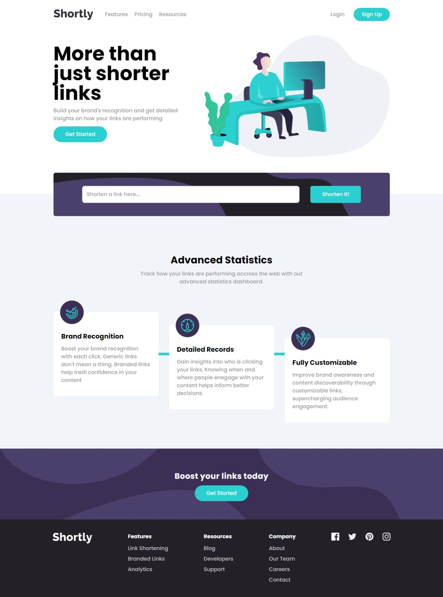

# Frontend Mentor - Shortly URL shortening API Challenge solution

This is a solution to the [Shortly URL shortening API Challenge challenge on Frontend Mentor](https://www.frontendmentor.io/challenges/url-shortening-api-landing-page-2ce3ob-G). Frontend Mentor challenges help you improve your coding skills by building realistic projects.

## Table of contents

- [Overview](#overview)
  - [The challenge](#the-challenge)
  - [Screenshot](#screenshot)
  - [Links](#links)
- [My process](#my-process)
  - [Built with](#built-with)
  - [What I learned](#what-i-learned)
  - [Continued development](#continued-development)
  - [Useful resources](#useful-resources)
- [Author](#author)
- [Acknowledgments](#acknowledgments)

## Overview

### The challenge

Users should be able to:

- View the optimal layout for the site depending on their device's screen size
- Shorten any valid URL
- See a list of their shortened links, even after refreshing the browser
- Copy the shortened link to their clipboard in a single click
- Receive an error message when the `form` is submitted if:
  - The `input` field is empty

### Screenshot

### Links

- Solution URL: [Go to solution URL](https://www.frontendmentor.io/solutions/responsive-url-shortener-landing-page-react-and-typescript-dNkvwzSaPD)
- Live Site URL: [url-shortener.com](https://url-shortener-api-landing-page.vercel.app/)

## My process

### Built with

- Semantic HTML5 markup
- CSS custom properties
- Flexbox
- Mobile-first workflow
- [React](https://reactjs.org/) - JS library
- [Tailwind CSS](https://tailwindcss.com/) - For styles

### What I learned

- I learnt about controlling an element's position using relative instead of absolute/fixed positioning
- I also learn't that the copy to clipboard API doesn't work in LocalHost or insecure connections
- Also learn't some cool button hover effect useing ::before.

### Continued development

There is alot to leaern about React in particular

### Useful resources
As always StackOverflow came through

## Author

- Frontend Mentor - [@NnadiVictory25](https://www.frontendmentor.io/profile/NnadiVictory25)
- Twitter - [@nnvictory001](https://www.twitter.com/nnvictory001)

## Acknowledgments

To people that I learnt from on stackoverflow
